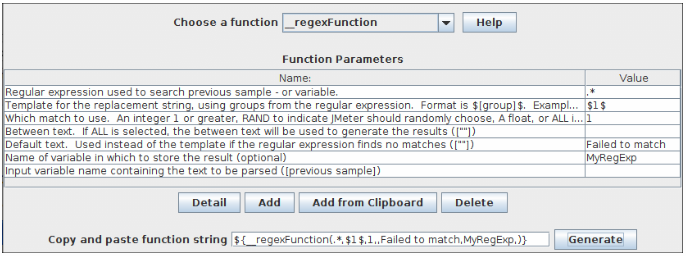

# 20. 函数和变量

JMeter 的函数是一些特殊值，它们可以填充在测试树的任何采样器或其他元件中。函数调用语法如下：

`${__functionName(var1,var2,var3)}`

其中“__functionName”匹配函数的名称。
圆括号内为函数参数，不同函数的参数也不同，例如 `${__time(YMD)}`。没有参数的函数可以不需要圆括号，例如 `${__threadNum}`。

如果函数的参数包含逗号，需要加上“`\`”来转义，否则 JMeter 会把逗号当做参数的分隔符。例如：

    ${__time(EEE\, d MMM yyyy)}
如果逗号没有被转义——例如 `${__javaScript(Math.max(2,5))}` ——你会得到像这样的错误信息：

    ERROR - jmeter.functions.JavaScript: Error processing Javascript: [Math.max(2]
    org.mozilla.javascript.EvaluatorException: missing ) after argument list (<cmd>#1)
这是因为字符串“`Math.max(2,5)`”被当做  __javascript 函数的两个参数：  
`Math.max(2` 和 `5)`  
其他错误信息也是有可能的。

变量的引用如下：

    ${VARIABLE}
**如果引用了未定义的变量或函数，那么 JMeter 并不会报告或者记录错误信息——引用返回值就是引用自身。例如，如果 `UNDEF` 没有被定义为变量，`${UNDEF}` 的返回值就是 `${UNDEF}`。** 变量和函数（包括属性）都是区分大小写的。**JMeter 会剔除变量名称中的空格，例如 `${__Random(1,63, LOTTERY )}` 中的变量‘　`LOTTERY `　’会被‘`LOTTERY`’取代。**
>属性与变量不一样。变量对线程而言是局部的；属性是针对所有线程的，属性需要使用 `__p` 或 `__property` 函数来引用。

>在使用 Windows 路径变量（例如 `C:\test\${test}`）之前使用 `\`，要确保使用 `\` 来转义，否则 JMeter 将不能解释变量，所以要这样写：`C:\\test\\${test}`。  
还有一种方法，就是使用 `/` 作为路径分隔符，例如 `C:/test/${test}`——Windows 的 Java 虚拟机在必要时会将它转化成路径分隔符。

函数列表，不严格的按类型划分：

 
|  函数类型   |          名称          |                                              注释                                              | 开始使用版本 |
| ----------- | ---------------------- | ---------------------------------------------------------------------------------------------- | ------------ |
| Information | [threadNum](#threadNum)              | get thread number                                                                              | 1.X          |
| Information | [samplerName](#samplerName)            | get the sampler name (label)                                                                   | 2.5          |
| Information | [machineIP](#machineIP)              | get the local machine IP address                                                               | 2.6          |
| Information | [machineName](#machineName)            | get the local machine name                                                                     | 1.X          |
| Information | [time](#time)                   | return current time in various formats                                                         | 2.2          |
| Information | [timeShift](#timeShift)              | return a date in various formats with the specified amount of seconds/minutes/hours/days added | 3.3          |
| Information | [log](#log)                    | log (or display) a message (and return the value)                                              | 2.2          |
| Information | [logn](#logn)                   | log (or display) a message (empty return value)                                                | 2.2          |
| Input       | [StringFromFile](#StringFromFile)         | read a line from a file                                                                        | 1.9          |
| Input       | [FileToString](#FileToString)           | read an entire file                                                                            | 2.4          |
| Input       | [CSVRead](#CSVRead)                | read from CSV delimited file                                                                   | 1.9          |
| Input       | [XPath](#XPath)                  | Use an XPath expression to read from a file                                                    | 2.0.3        |
| Calculation | [counter](#counter)                | generate an incrementing number                                                                | 1.X          |
| Calculation | [intSum](#intSum)                 | add int numbers                                                                                | 1.8.1        |
| Calculation | [longSum](#longSum)                | add long numbers                                                                               | 2.3.2        |
| Calculation | [Random](#Random)                 | generate a random number                                                                       | 1.9          |
| Calculation | [RandomDate](#RandomDate)             | generate random date within a specific date range                                              | 3.3          |
| Calculation | [RandomFromMultipleVars](#RandomFromMultipleVars) | extracts an element from the values of a set of variables separated by                         | 3.1          |
| Calculation | [RandomString](#RandomString)           | generate a random string                                                                       | 2.6          |
| Calculation | [UUID](#UUID)                   | generate a random type 4 UUID                                                                  | 2.9          |
| Scripting   | [groovy](#groovy)                 | run a Groovy script                                                                            | 3.1          |
| Scripting   | [BeanShell](#BeanShell)              | run a BeanShell script                                                                         | 1.X          |
| Scripting   | [javaScript](#javaScript)             | process JavaScript (Nashorn)                                                                   | 1.9          |
| Scripting   | [jexl2](#jexl2)                  | evaluate a Commons Jexl2 expression                                                            | jexl2(2.1.1) |
| Scripting   | [jexl3](#jexl3)                  | evaluate a Commons Jexl3 expression                                                            | jexl3 (3.0)  |
| Properties  | [property](#property)               | read a property                                                                                | 2.0          |
| Properties  | [P](#P)                      | read a property (shorthand method)                                                             | 2.0          |
| Properties  | [setProperty](#setProperty)            | set a JMeter property                                                                          | 2.1          |
| Variables   | [split](#split)                  | Split a string into variables                                                                  | 2.0.2        |
| Variables   | [V](#V)                      | evaluate a variable name                                                                       | 2.3RC3       |
| Variables   | [eval](#eval)                   | evaluate a variable expression                                                                 | 2.3.1        |
| Variables   | [evalVar](#evalVar)                | evaluate an expression stored in a variable                                                    | 2.3.1        |
| String      | [regexFunction](#regexFunction)          | parse previous response using a regular expression                                             | 1.X          |
| String      | [escapeOroRegexpChars](#escapeOroRegexpChars)   | quote meta chars used by ORO regular expression                                                | 2.9          |
| String      | [char](#char)                   | generate Unicode char values from a list of numbers                                            | 2.3.3        |
| String      | [unescape](#unescape)               | Process strings containing Java escapes (e.g. \n & \t)                                         | 2.3.3        |
| String      | [unescapeHtml](#unescapeHtml)           | Decode HTML-encoded strings                                                                    | 2.3.3        |
| String      | [escapeHtml](#escapeHtml)             | Encode strings using HTML encoding                                                             | 2.3.3        |
| String      | [escapeXml](#escapeXml)              | Encode strings using XMl encoding                                                              | 3.2          |
| String      | [urldecode](#urldecode)              | Decode a application/x-www-form-urlencoded string                                              | 2.10         |
| String      | [urlencode](#urlencode)              | Encode a string to a application/x-www-form-urlencoded string                                  | 2.10         |
| String      | [TestPlanName](#TestPlanName)           | Return name of current test plan                                                               | 2.6          |
## 20.1 函数可以做什么
JMeter 有两种函数：用户定义的静态值（或变量）和内建函数。  
用户定义的静态值允许用户在编译或者运行测试树时，使用自定义变量来替换静态值。这种替换只在测试运行的开始阶段执行一次。例如，可以用自定义变量来替换所有 HTTP 请求的 DOMAIN 域，这样就使得测试变更在不同服务器执行相同测试成为一件简单的事情。  

注意，目前变量不支持嵌套，例如 `${Var${N}}` 是无效的，但是可以使用函数 `__V(variable)` 来实现嵌套变量的目的：`${__V(Var${N})}`。同样可以用 `${__BeanShell(vars.get("Var${N}")}` 来实现。  

这种类型的替换可以不用函数来实现，但是这样就没有那么方便和直观了。用户可以创建默认配置元件来填充采样器中的空值。变量可以替换任何给定值的一部分，而不是只填充空值。  

使用内建函数用户可以在运行时根据之前的响应数据、函数所在线程、当前时间和其他资源计算出新的变量值。这些变量的值在测试过程中会根据每个请求动态刷新。
>函数被线程共享。在测试计划中每次函数的调用，都由一个单独的函数实例来处理。

## 20.2 函数和变量可以用在哪？
函数和变量可以用在任何测试元件的任何输入域中（除了测试计划——见下文）。有些输入域只接受数字而不支持字符串，因此它们也不支持函数。然而，大多数输入域还是支持函数的。  

在测试计划中使用函数是有限制的。当函数被调用时，JMeter 线程变量并没有完全初始化，因此变量名称作为参数传递时也没有初始化，变量会引用失败，所以 `split()` 和 `regex()` 和变量赋值函数都不能正常工作。`threadNum()` 函数也不会工作（它在测试计划层也没有意义）。下面是可以在测试计划中使用的的函数：
* intSum
* longSum
* machineName
* BeanShell
* groovy
* javaScript
* jexl2/jexl3
* random
* time
* property functions
* log functions

配置元件是由独立线程处理的。因此像 `__threadNum` 这样的函数在一些测试元件（例如用户定义的变量）中不能正常地工作。同样要注意在用户定义的变量（UDV）中定义的变量，在 UDV 被处理前是不能使用的。
>当在 SQL 代码（或其他）中引用变量/函数时，要记得给文本字符串添加必要的引号，即使用
>
>       SELECT item from table where name='${VAR}'
>而不是
>
>       SELECT item from table where name=${VAR}
>除非 `VAR` 本身包含引号

## 20.3 如何引用变量和函数
在测试元件中引用一个变量可以通过使用 `${` 和 `}` 将变量名称括起来实现。  

函数引用的方法相同，但是按照惯例，函数名称以“`__`”开头来和变量名称区分开。一些函数带参数，参数放在圆括号中，用逗号分隔。如果函数不带参数，可以省略圆括号。  

**如果参数本身带逗号，必须将其转义。可以使用‘`\,`’来转义。** 这适用于例如脚本函数——Javascript, Beanshell, Jexl, groovy——有必要对所有脚本函数调用中的逗号加以转义，例如

    ${__BeanShell(vars.put("name"\,"value"))}
换一种方法，你也可以将你的脚本定义为一个变量，例如在测试计划中定义：

    SCRIPT          vars.put("name","value")
定义过的脚本可以像下面这样被引用：

    ${__BeanShell(${SCRIPT})}
在 `SCRIPT` 变量中就没有必要对逗号进行转义了，因为函数的调用在变量用其值替换之前被解析。该方法适用于 JSR223 或者 BeanShell 采样器，这两种采样器可用来测试 Javascript, Jexl 和 BeanShell 脚本。  

函数可以引用参数和其他函数，例如 `${__XPath(${__P(xpath.file),${XPATH})}` 使用“`xpath.file`”的值作为文件名，使用变量 `XPATH` 的内容作为搜索表达式。  

JMeter 提供一个工具来帮助建立各种内置函数的函数调用，只需使用复制-粘贴就可以实现。它不会自动为你转义，因为函数可以作为其他函数的参数，应该只对文本内容进行转义。
>如果一个字符串既包含反斜杠（‘`\`’）又包含函数或者变量引用，出现在‘`$`’或‘`,`’或‘`\`’之前的反斜杠会被移除。这种操作对于包含逗号或者 `${` 的嵌套函数是有必要的。如果一个字符串不包含函数或者变量引用，那么在‘`$`’或‘`,`’或‘`\`’之前的反斜杠不会被移除。

变量或函数的值可以用 [`__logn()`](#logn) 函数来报告，`__logn()` 函数在要报告的变量被定义之后可以在测试计划的任何地方被引用。除此之外，Java 请求采样器可以用来生成一个包含变量引用的采样；其输出能在合适的监听器中显示。注意也可以通过在查看结果树中使用 [Debug Sampler](http://jmeter.apache.org/usermanual/component_reference.html#Debug_Sampler) 来显示变量的值。
>如果用和内建函数同样的名称定义一个用户静态变量，那么定义的静态变量将覆盖同名内置函数。

## 20.4 函数助手对话框
函数助手对话框可以在 JMeter 的工具菜单中找到。  
    　　 
     　　_函数助手对话框_  

使用函数助手，可以从下拉列表中选择一个函数，并给它的参数赋值。表格左列是参数的简要说明，表格的右列填入相应参数的值。不同的函数有不同的参数。  

上述操作完成之后，点击“生成”按钮，相应调用函数的字符串就生成了，你可以复制-招贴到测试计划中的任何地方。

## 20.5 函数

<h3 id="regexFunction">__regexFunction</h3>

正则表达式函数可以使用任意正则表达式（用户提供的）来解析前面的服务器响应（或变量值）。函数返回填充了变量值的模版字符串。  

`__regexFunction` 也可以存储值供以后使用。你可以在它的第六个参数中设定一个引用名称。在函数执行之后，可以使用用户定义的值的语法在稍后时间检索相同的值。例如，如果输入 “`refName`” 作为第六个参数,那么可以使用：
* `${refName}` 来引用该函数解析的第二个参数（“Template for the replacement string”）的计算结果
* `${refName_g0}` 来引用该函数解析的整个匹配
* `${refName_g1}` 来引用该函数解析的第一个匹配组合
* `${refName_g#}` 来引用该函数解析的第 N 个匹配组合
* `${refName_matchNr}` 来引用该函数解析的匹配组合数量

>如果使用分布式测试，要切换模式（见 `jmeter.properties`）确保它不在剥离模式下，参见 [`Bug 56376`](https://bz.apache.org/bugzilla/show_bug.cgi?id=56376)。

#### 参数（Parameters）
---
属性（Attribute）| 描述| 是否必须
---------|----------|---------
 第一个参数 | 第一个参数是解析响应数据的正则表达式。它会抓取所有匹配。若你希望在模版字符串中使用的该表达式中的任何部分，请给它（要使用的部分）加上括号。例如：`<a href="(.*)">`。它将抓取链接值并储存在第一个匹配组合中（这里只有一个匹配组合）。另一个例子：`<input type="hidden" name="(.*)" value="(.*)">`。它将抓取 name 的值作为第一个匹配组合，value 的值作为第二个匹配组合。这些匹配的值可以用在模版字符串中。| 是
 第二个参数| 这是一个运行时会替换函数的模版字符串。要引用正则表达式中捕获的匹配组合，使用下面的句法：`$[group_number]$`。例如 `$1$` 或者 `$2$`你的模版可以是任意字符串。 |是
 第三个参数 | 第三个参数告诉 JMeter 使用第几个匹配。你的正则表达式可能找到多个匹配。对此有四个选项：   <ul><li> 整数——直接告诉 JMeter 使用第几个匹配。‘`1`’对应第一个，‘`2`’对应第二个，以此类推。 </li><li> `RAND`——告诉 JMeter 使用随机匹配。</li><li> `ALL`——告诉 JMeter 使用所有匹配，对应每个匹配生成一个模版字符串并将它们组合到一起。这个选项很少用到。</li><li> 0 到 1 之间的浮点数——告诉 JMeter 根据公式（总的匹配个数*浮点值）计算使用第几个匹配项，计算值向最近的整数取整</li></ul> | 否，默认值 = 1
 第四个参数 | 如果上一个参数选择 `ALL`，这个参数会被插入到每个重复的模版值之间 | 否
 第五个参数 | 如果没有匹配项返回的默认值| 否
 第六个参数 | 重用此函数解析的值的引用名称,储存的值包括 `${refName}`（替换的模版字符串）和 `${refName_g#}` ,其中“`#`”代表正则表达式匹配分组的序号（“`0`”可以用来引用整个匹配） | 否
 第七个参数 | 输入变量名称。如果指定了这个参数，那么将使用变量的值作为输入，而不是使用之前的采样结果。 | 否
[【返回标题】](#20-函数和变量) [【返回函数列表】](#functions_list)

<h3 id="counter">__counter</h3>

